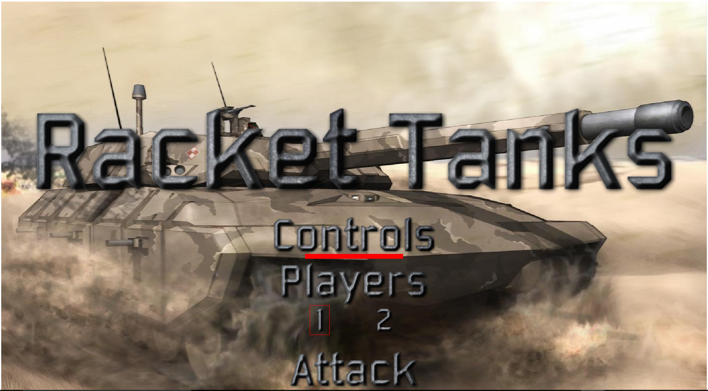
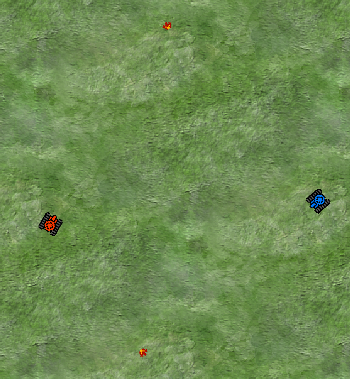
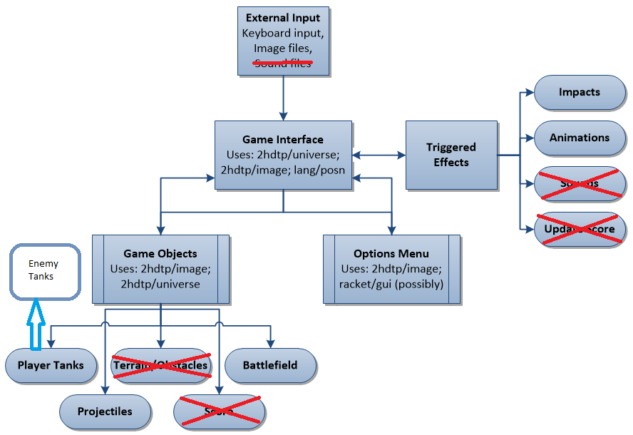
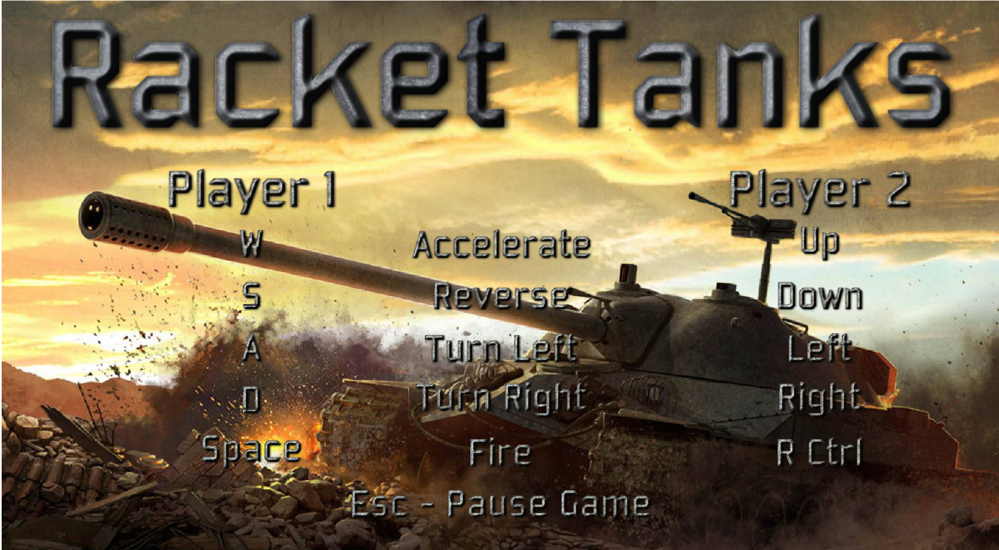

# Racket Tanks

### Statement
A classic top-down shooting game which will  use recursion, filtering, object orientation, and other techniques to control the action.

### Analysis
Below is an outline of the various techniques that will be implemented in the design of the game:

-Data Abstraction: Data will be abstracted into basic objects with similar factors, i.e. dimensions, speed, location, active status, and so on. This will allow objects like tanks, bullets, and enemies to be handled similarly.
- Filtering: As objects are created, and destroyed, it will be necessary to ensure that objects that are no longer necessary are removed. This is one excellent way to use a filter to ensure that extraneous objects are deleted.
- Recursion: Updating the location information, and status of each of the objects will be most easily handled with recursive functions that will go through their relevant lists.
- Expression evaluation: As each of the objects move around the screen, their various maneuvers and collisions will be calculated using expression evaluation to determine changes.
- Metacircular evalutaion: To some extent a metacircular evaluator is created in this program, and is used within player and projectile objects as well as generic entites to define their respective elements. This is nut dissimilar to a class object in C or C++ (or any other object oriented language).

### Data Sets or other Source Materials

Source Materials:

Many of the objects that will be used in this game come from pre-existing images, namely sprites, that are commonplace around the Internet. This approach is to allow for a maximum amount of customizability to the game oddly enough, as using these will allow a player to select from various battlefields, tanks, and going forward, potentially different weapons, and enemies.

Credit due to the following creators of content used:

Tank sprites courtesy of user Zironid_n at www.opengameart.org

### Deliverable and Demonstration

We are presenting a top-down tank combat game that uses sprites, and calculations to determine object movement and interaction.

### Results

While the game runs smoothly, there are obviously some issues. Chiefly, we were unable to get an effective means for randomized enemy movement to work, and as such, we were unable to include them in the final product yet. Additionally, options such as impact animation, sound effects, and terrain were also not yet implemented as hammering out the process to get movement of player tanks working correctly took precedence.

That said, successful implementation of the player sprites, movement vectors, rotation, keyboard controls, and collision detection allows us to believe that we are close to being able to implement these things, allowing for a more complete game.

The structure of the program uses multiple layers of abstraction, implementing player objects and images withiin a game world, and in turn implementing bullets within each player (and enemy) object.

## Architecture Diagram

As seen above, external to the Racket script are the keyboard strokes, as well as files that are externally sourced for sound and sprite images, all of which are fed into the Game Interface. This is internally referred to as a world by the 2hdtp/universe library, and serves as the central "hub" for each element of the game. 
The game world is comprised of, and controls the Game Objects, Options Menu, and Triggered Effects objects. Each of these subsets of objects are themselves comprised of objects. Game Objects are comprised of player tanks, terrain and obstacles that will be in the battlefield, the battlefield/background, the list of projectiles, and the score for each player. Changes in these objects are handled by the Triggered Effects, which is where impacts, animations, sounds, and score updates will be determined. As needed, these changes are then fed back to the Game interface, and in turn the game objects, in order to then update them accordingly.
Any objects within the achitecture that are crossed out were not successfully implemented by the time of the demonstration.

## Objectives Achieved

Jeremy's Objectives:
- Successfully implemented access to image files used for player tanks, enemies, background etc.
- Movement and rotation vectors are established to allow proper control and orientation of both tanks and bullets.
- Collisions between tanks and bullets are detected and destruction of impacted objects and objects that leave the screen is in place.
- Keyboard commands for movement, rotation, and fireing in place.
- Menu for number of players, and listing of controls in place.
- Redesign of display screen values so game runs in a single window, rather than opening a second window when the game starts successfully put into effect.

Zheondre's Objectives: 
- Designed enemy class
- For each level the difficulty increased by having more enemies
- Need to add score board, health, and ammuniczation. 
- Designed rancom walk for enemies when they are not alerted

Enemy implementations, level development, score board for health and ammunition. 
Try to add pausing, level check points, reset, and game over features. Have diffifulty settings working.
